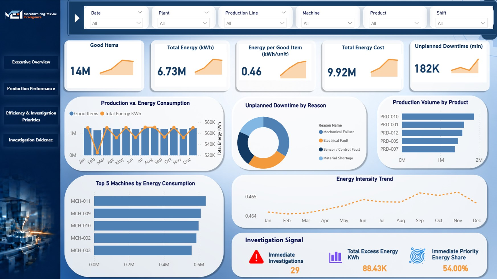
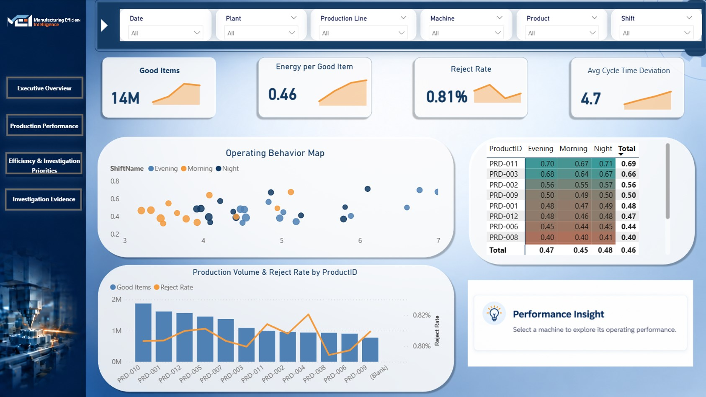
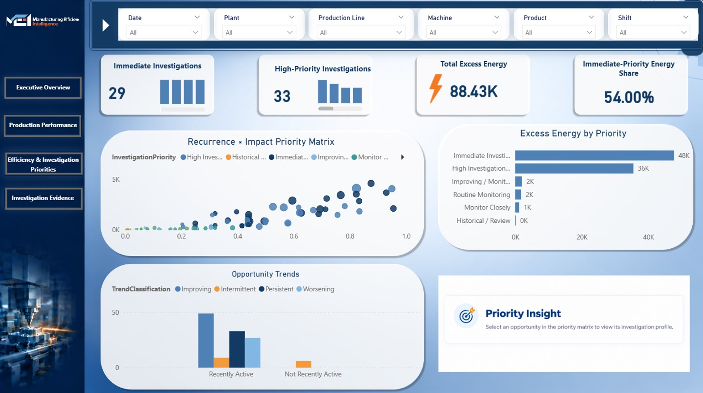
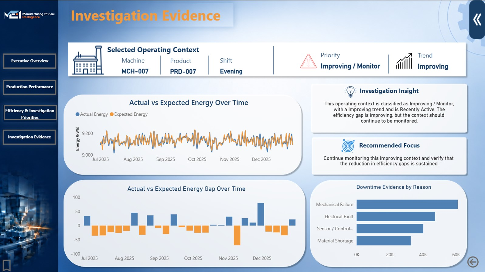

# Manufacturing Efficiency Analytics & Decision Support

> **From energy monitoring to context-aware efficiency analysis and prioritized decision support.**

## 📌 Project Overview

Manufacturing energy consumption cannot be evaluated effectively through energy usage alone.

Energy use naturally varies with production levels and operating conditions. As a result, simple energy-based comparisons can hide recurring efficiency gaps and make it difficult for manufacturing teams to determine where investigation should begin.

This project develops a **Manufacturing Efficiency Analytics & Decision Support solution** that analyzes energy performance within comparable operating contexts, compares actual performance against expected performance, identifies meaningful efficiency gaps, and supports the prioritization of areas requiring further investigation.

The solution combines **SQL, Python, Machine Learning, and Power BI** into an integrated analytical workflow.

---

## 🎯 Problem Statement

Manufacturing managers need to understand whether observed energy consumption is reasonable for the conditions under which production takes place.

However:

* Energy consumption varies with production and operating conditions.
* Energy-only comparisons can hide recurring efficiency gaps.
* Potential inefficiencies can be difficult to identify and prioritize.
* Decision-makers need evidence to determine where further investigation should begin.

The project therefore focuses on moving beyond descriptive energy monitoring toward **context-aware efficiency assessment and evidence-based decision support**.

---

## 💡 Proposed Solution

The project follows a context-aware analytical approach:

### 1. Data Preparation

Clean, transform, and structure the manufacturing data to establish a reliable foundation for analysis.

### 2. Context-Aware Analysis

Evaluate energy performance within comparable operating conditions rather than relying only on absolute energy consumption.

### 3. Expected-Energy Benchmarking

Establish expected energy performance for different operating contexts.

### 4. Actual vs Expected Analysis

Compare actual energy performance with expected performance to quantify meaningful efficiency gaps.

### 5. Efficiency Gap Prioritization

Identify recurring gaps and prioritize them based on their magnitude and supporting operational evidence.

### 6. Decision Support

Present the analytical results through an interactive Power BI dashboard to help manufacturing and operations managers identify **where to investigate first**.

---

## 🔄 Project Workflow

```text
Manufacturing Data
        ↓
Data Cleaning & Preparation
        ↓
SQL Database & Analysis
        ↓
Exploratory Data Analysis
        ↓
Context-Aware Analysis
        ↓
Expected-Energy Benchmarking
        ↓
Actual vs Expected
        ↓
Efficiency Gap Detection
        ↓
Gap Prioritization
        ↓
Power BI Decision-Support Dashboard
```

---

## 📊 Key Analytical Questions

The project focuses on questions such as:

* How does energy consumption vary with production and operating conditions?
* What does expected energy performance look like under comparable conditions?
* Where do actual energy values deviate meaningfully from expected performance?
* Which efficiency gaps recur across the data?
* Which gaps should receive further operational investigation?
* How can the findings be communicated clearly to decision-makers?

---

## 🛠️ Technology Stack

| Area                | Tools                 |
| ------------------- | --------------------- |
| Data Preparation    | Python, Pandas, NumPy |
| Database & Querying | SQL Server            |
| Data Analysis       | Python, Pandas, NumPy |
| Machine Learning    | Python, Scikit-learn  |
| Visualization & BI  | Power BI, DAX         |

---

## 📂 Dataset

Dataset: The project was developed using a manufacturing efficiency dataset provided for analytical and educational purposes. The original dataset is not included in this repository.

---
🗄️ SQL Analysis

SQL was used to structure and investigate the manufacturing data and support the analytical workflow.

The SQL stage focuses on areas such as:

Production and energy performance
Operational context
Aggregations and trends
Efficiency indicators
Expected vs actual performance
Efficiency-gap analysis
Decision-support tables
🐍 Python Analysis

Python was used for data profiling, preparation, exploration, and analytical modeling.

Key activities include:

Data inspection
Missing-value and quality assessment
Data cleaning
Feature preparation
Exploratory analysis
Context-aware analysis
Analytical modeling
Expected-energy benchmarking
Efficiency-gap investigation

## 📈 Power BI Dashboard

The Power BI dashboard translates the analytical findings into an interactive decision-support interface.

It focuses on:

* Energy performance
* Production and operating context
* Actual vs expected energy performance
* Efficiency gaps
* Recurring inefficiencies
* Gap prioritization
* Areas requiring further investigation

## 📊 Dashboard Overview

Here are the key views and analytical dashboards included in this project:

<div align="center">

### Executive Overview & Energy Consumption


<br/>

### Production Efficiency & OEE Analysis


<br/>

### Context-Aware Anomaly Detection


<br/>

### Decision Support & Prioritized Actions


</div>


---

## 🎯 Target Users

**Primary users:**

* Manufacturing Managers
* Operations Managers

The solution is designed to support operational investigation and prioritization by providing analytical evidence alongside the underlying performance indicators.

---

## 🌍 Project Impact

The project aims to move manufacturing energy analysis beyond simple monitoring.

### From:

**"How much energy was consumed?"**

### Toward:

**"Was the energy consumption reasonable for the operating context, and where should we investigate further?"**

This shift enables a more structured approach to identifying and prioritizing potential efficiency issues.

---

## 🚀 Future Work

The project can be extended through:

* More advanced predictive expected-energy modeling.
* Validation using real manufacturing operational data.
* Integration of real-time manufacturing data.
* Continuous efficiency assessment.
* Further automation of the analytical workflow.

---

## 🔑 Key Takeaway

This project connects **data preparation, SQL analysis, context-aware analytics, expected-energy benchmarking, efficiency-gap detection, and Power BI** to transform manufacturing energy data into actionable analytical evidence.

> **The goal is not only to monitor energy consumption, but to understand performance in context and identify where investigation should begin.**
